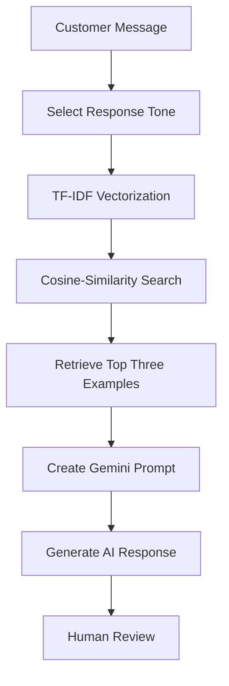

# ReplyPilot AI

ReplyPilot AI is an AI-assisted customer-support response generator built with Streamlit, the Gemini API, and real historical customer-support conversations.

The application helps customer-support employees draft professional, friendly, or empathetic responses to customer inquiries. It retrieves similar historical support conversations from a prepared dataset and provides them to Gemini as contextual examples before generating a new response.

> ReplyPilot AI is designed as an employee-assistance tool. Every generated response should be reviewed by a human before it is sent to a customer.

## Live Application

* **Streamlit Application:** [https://replypilot-ai-fmqsqmgss4jtefumnszr8j.streamlit.app/]
* **GitHub Repository:** [https://github.com/sasa312002/replypilot-ai]
* **Developed by:** [T.M.T.S.B Tennakoon]
* **Date:** [28/08/2026]

## Project Overview

Customer-support employees frequently respond to repetitive inquiries related to deliveries, payments, refunds, cancellations, account access, and other service issues.

Writing each response manually can:

* Increase response time.
* Produce inconsistent communication styles.
* Make it difficult to reuse knowledge from previous support cases.
* Increase the workload of customer-support employees.

ReplyPilot AI addresses this problem by combining information retrieval with Generative AI.

The user enters a customer message and selects a preferred response tone. The application then retrieves the three most similar historical customer-support conversations using TF-IDF and cosine similarity. These examples are included in a structured prompt sent to Gemini, which generates a new response for human review.

## Main Objectives

The main objectives of ReplyPilot AI are to:

* Reduce the time required to draft customer-support responses.
* Generate professional and context-aware replies.
* Allow users to select the preferred response tone.
* Reuse information from historical customer-support conversations.
* Show the retrieved examples used as context.
* Maintain human control over the final response.
* Demonstrate a practical business use case for Generative AI.

## Key Features

* AI-generated customer-support responses
* Professional, Friendly, and Empathetic response tones
* Retrieval of three similar historical support conversations
* TF-IDF text vectorization
* Cosine-similarity ranking
* Gemini API integration
* Retrieved-example transparency
* Technical-details view
* Response download option
* Input validation
* API error handling
* Human-review reminder
* Streamlit web dashboard
* Cloud deployment support

## How the Application Works

The application follows the workflow below:

1. A customer-support employee enters a customer message.
2. The employee selects a response tone.
3. The application converts the message into a TF-IDF vector.
4. Cosine similarity is used to compare the message with historical customer messages.
5. The three most similar customer-support conversations are retrieved.
6. The customer message, selected tone, retrieved examples, and safety instructions are added to a structured prompt.
7. The prompt is sent to the Gemini API.
8. Gemini generates a suggested customer-support response.
9. The generated response and retrieved examples are displayed in the Streamlit dashboard.
10. A human employee reviews and edits the response before sending it to the customer.



## Technology Stack

| Technology                | Purpose                                    |
| ------------------------- | ------------------------------------------ |
| Python                    | Main programming language                  |
| Streamlit                 | Interactive web application                |
| Pandas                    | Dataset loading and processing             |
| Scikit-learn              | TF-IDF vectorization and cosine similarity |
| Google GenAI SDK          | Connection to the Gemini API               |
| Gemini 3.1 Flash-Lite     | Generative language model                  |
| Kaggle Dataset            | Historical customer-support conversations  |
| Streamlit Community Cloud | Application deployment                     |
| GitHub                    | Source-code management                     |

## Dataset

The project uses the **Customer Support on Twitter** dataset available on Kaggle.

Dataset source:

[Customer Support on Twitter – Kaggle](https://www.kaggle.com/datasets/thoughtvector/customer-support-on-twitter)

The original dataset contains real historical conversations between customers and customer-support accounts.

The dataset is not used to train or fine-tune Gemini. It is used only to retrieve similar historical conversations and provide contextual examples to the model.

### Dataset Preparation

The dataset preparation process includes:

1. Loading the original `twcs.csv` dataset.
2. Identifying inbound customer messages.
3. Matching each customer message with its direct outbound support-agent response.
4. Removing records without valid customer-agent response pairs.
5. Removing URLs, usernames, HTML entities, and unnecessary characters.
6. Removing duplicated or empty conversations.
7. Cleaning support-agent signatures and repeated punctuation.
8. Saving a smaller processed dataset for faster retrieval.

The prepared dataset contains the following main columns:

| Column             | Description                                |
| ------------------ | ------------------------------------------ |
| `customer_message` | Historical message sent by a customer      |
| `agent_response`   | Response provided by a human support agent |
| `company`          | Customer-support account or company name   |

The active number of records loaded by the application is displayed directly on the Streamlit dashboard.

## Retrieval Method

ReplyPilot AI uses a lightweight retrieval approach based on TF-IDF and cosine similarity.

### TF-IDF

TF-IDF stands for **Term Frequency-Inverse Document Frequency**.

It converts text into numerical vectors and gives higher importance to words that are relevant to a particular message but less common across the complete dataset.

### Cosine Similarity

Cosine similarity measures how similar two text vectors are.

When a user enters a customer message, the system compares it with all historical customer messages and ranks them according to similarity. The three highest-ranked conversations are selected as contextual examples.

This approach was selected because it is:

* Fast
* Lightweight
* Easy to understand
* Suitable for a demonstration dataset
* Free from additional embedding API costs

## Gemini Integration

The application uses the Gemini API to generate the final response.

The prompt sent to Gemini contains:

* The new customer message
* The selected response tone
* The three retrieved historical conversations
* Human-agent responses from those conversations
* Instructions for generating a safe and professional reply
* Instructions not to invent customer, order, refund, payment, or delivery information

Gemini uses this information to create a new response appropriate for the submitted customer message.

The project does not train a new machine-learning model. Gemini is already pretrained and is accessed through an API.

## Project Structure

```text
replypilot-ai/
├── data/
│   ├── raw/
│   │   └── twcs.csv
│   └── processed/
│       └── customer_support_pairs.csv
├── .streamlit/
│   └── secrets.toml
├── assets/
│   ├── dashboard-overview.png
│   ├── generated-response.png
│   ├── retrieved-examples.png
│   └── technical-details.png
├── app.py
├── download_dataset.py
├── prepare_dataset.py
├── retrieval.py
├── gemini_service.py
├── requirements.txt
├── .gitignore
└── README.md
```

## File Descriptions

| File                  | Description                                                           |
| --------------------- | --------------------------------------------------------------------- |
| `app.py`              | Creates the Streamlit dashboard and manages user interactions         |
| `download_dataset.py` | Downloads or assists with obtaining the original dataset              |
| `prepare_dataset.py`  | Matches, cleans, and prepares customer-agent conversations            |
| `retrieval.py`        | Performs TF-IDF vectorization and cosine-similarity retrieval         |
| `gemini_service.py`   | Builds the prompt and communicates with the Gemini API                |
| `requirements.txt`    | Contains the required Python packages                                 |
| `.gitignore`          | Prevents secrets, raw data, and environment files from being uploaded |
| `README.md`           | Provides project documentation                                        |

## Local Installation

### 1. Clone the Repository

```bash
git clone YOUR_GITHUB_REPOSITORY_URL
cd replypilot-ai
```

### 2. Create a Virtual Environment

```bash
python -m venv .venv
```

Activate it using Windows PowerShell:

```powershell
.venv\Scripts\Activate.ps1
```

### 3. Install the Required Packages

```bash
pip install -r requirements.txt
```

The main dependencies include:

```text
streamlit
google-genai
pandas
scikit-learn
requests
kagglehub
```

### 4. Add the Dataset

Download `twcs.csv` from the Kaggle dataset page and place it inside:

```text
data/raw/twcs.csv
```

Prepare the cleaned dataset by running:

```bash
python prepare_dataset.py
```

The processed file will be saved as:

```text
data/processed/customer_support_pairs.csv
```

### 5. Configure the Gemini API Key

Create the following file:

```text
.streamlit/secrets.toml
```

Add the Gemini API key:

```toml
GEMINI_API_KEY = "YOUR_GEMINI_API_KEY"
```

The API key must never be added directly to the Python source code or uploaded to GitHub.

### 6. Run the Application

```bash
streamlit run app.py
```

If the browser does not open automatically, visit:

```text
http://localhost:8501
```

## Application Usage

1. Open the ReplyPilot AI Streamlit application.
2. Select a response tone:

   * Professional
   * Friendly
   * Empathetic
3. Enter a customer-support message.
4. Select **Generate AI Response**.
5. Review the generated response.
6. Open the **Retrieved Examples** tab to inspect the historical conversations.
7. Open the **Technical Details** tab to view the model and retrieval information.
8. Download the generated response if required.
9. Review and edit the response before sending it to a customer.

## Example Input

**Selected tone:** Empathetic

```text
My order was expected five days ago, but I still have not received it. I am very disappointed with the service.
```

## Example Output

```text
I am very sorry to hear that your order has not arrived as expected. I understand how frustrating it is to experience a delay, and I sincerely apologize for the inconvenience this has caused.

To help investigate the status of your shipment, could you please provide your order number? Once that information is available, the support team can review the delivery status and assist you further.
```

The exact response may vary because it is generated dynamically by Gemini.

## Application Output

The Streamlit dashboard provides three main output sections.

### Generated Response

Displays the AI-generated customer-support reply. The response can be reviewed and downloaded as a text file.

### Retrieved Examples

Displays the three historical conversations retrieved from the dataset, including:

* Historical customer message
* Human-agent response
* Support account or company
* Similarity score

### Technical Details

Displays information about the generation process, including:

* Gemini model
* Selected response tone
* Retrieval method
* Similarity method
* Submitted customer message

## Testing Scenarios

The application can be tested using the following messages.

### Delivery Issue

```text
My order was expected five days ago, but I still have not received it.
```

### Payment Issue

```text
My card was charged twice for the same order. Please help me resolve this problem.
```

### Account Issue

```text
I cannot log in to my account even after resetting my password.
```

### Cancellation Request

```text
I placed an order by mistake and would like to cancel it before it is dispatched.
```

### Refund Request

```text
I returned the product last week, but I have not received my refund.
```

## Business Value

ReplyPilot AI can provide the following benefits to a customer-support team:

* Faster preparation of customer responses
* More consistent communication
* Reduced repetitive writing
* Better use of historical support knowledge
* Visible evidence behind generated responses
* Improved employee productivity
* Greater control through human review
* A foundation for future customer-support automation

## Safety and Responsible Use

ReplyPilot AI must be used as an assistance tool rather than an autonomous customer-support system.

The following guidelines should be followed:

* Every generated response must be reviewed by a human employee.
* Generated responses should not be treated as verified company decisions.
* Real passwords, payment details, or sensitive personal information should not be entered.
* Gemini should not be allowed to confirm refunds, payments, cancellations, or deliveries without verification.
* The Gemini API key must be stored securely.
* The API key and `secrets.toml` file must not be uploaded to GitHub.
* Historical responses should be reviewed before being used in a production environment.
* A production version should use approved company policies and support documents.

## Limitations

The current version has the following limitations:

* Retrieval quality depends on the size and quality of the prepared dataset.
* TF-IDF mainly identifies lexical similarity and may not fully understand semantic meaning.
* Historical Twitter responses may not match the policies of a particular company.
* Gemini may occasionally generate incomplete or inaccurate information.
* The application requires internet access for Gemini API requests.
* Gemini API usage depends on the available API quota.
* The current version mainly supports English customer messages.
* The application does not directly access real orders, customer accounts, or payment systems.

## Future Improvements

Future versions of ReplyPilot AI could include:

* Organization-specific FAQ and policy documents
* Semantic retrieval using text embeddings
* A vector database such as FAISS or ChromaDB
* Customer-intent classification
* Sentiment detection
* Sinhala and multilingual response generation
* User authentication and role-based access
* Response history and audit logs
* Human-feedback collection
* Response-quality evaluation
* CRM or ticketing-system integration
* Real-time order-status integration
* Usage analytics and performance monitoring

## Deployment

The application can be deployed using Streamlit Community Cloud.

Deployment requirements:

1. Upload the project source files to GitHub.
2. Ensure `requirements.txt` is included.
3. Ensure the processed dataset is included if redistribution is permitted.
4. Do not upload `.streamlit/secrets.toml`.
5. Connect the GitHub repository to Streamlit Community Cloud.
6. Select `app.py` as the main application file.
7. Add `GEMINI_API_KEY` through Streamlit Cloud Secrets.
8. Deploy and test the public application URL.

## Conclusion

ReplyPilot AI demonstrates how Generative AI can support a practical customer-service workflow.

The application combines historical conversation retrieval with Gemini-based response generation. TF-IDF and cosine similarity identify relevant historical support cases, while Gemini uses those examples to generate a professional and context-aware response.

The solution does not replace customer-support employees. Instead, it helps them prepare responses more efficiently while maintaining human review, transparency, and responsibility.
